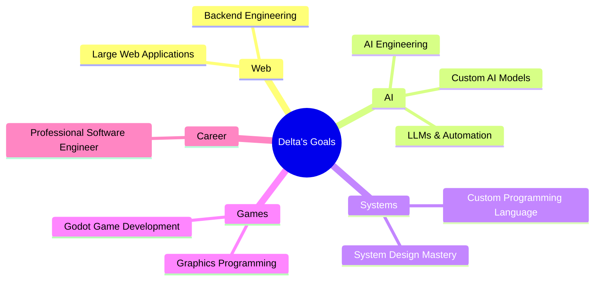

# 👋 Hi there, I'm Delta

<div align="center">

<!-- Visitor Badge -->


<!-- Typing SVG -->


</div>

---

## 🧠 About Me

```yaml
name: Delta
role: Self-taught Programmer
philosophy: "Understand how things work internally, not just how to use them."
focus: Building software from scratch
```

I'm a **self-taught programmer** passionate about building software from the ground up. I enjoy diving deep into how systems work internally rather than relying solely on frameworks and abstractions.

### 🔍 Main Interests

| | | | |
|:---:|:---:|:---:|:---:|
| 🤖 Artificial Intelligence | 🌐 Full Stack Web Development | 🎮 Game Development | ♟️ Chess Software |
| 💻 Programming Languages | 🏛️ Software Architecture | 🌱 Open Source | 🔬 Deep Systems Understanding |

---

## 🎯 Current Goals

<div align="center">



</div>

- 🏗️ Building large-scale web applications
- ⚙️ Learning backend engineering in depth
- 🧠 Mastering AI engineering
- 🔣 Creating my own programming language
- 🤖 Building my own AI models from scratch
- 🎮 Developing immersive games with Godot
- 📐 Improving system design skills
- 🚀 Becoming a professional software engineer

---

## 🛠️ Technologies & Tools

### 💻 Languages
<p>
  
  
  
  
  
</p>

### ⚛️ Frameworks & Libraries
<p>
  
  
  
</p>

### 🗄️ Databases
<p>
  
  
</p>

### 🎨 Design & 3D
<p>
  
</p>

### 🔧 Tools & Platforms
<p>
  
  
  
</p>

### 🚧 Currently Learning / Future Stack
<p>
  
  
  
  
  
  
  
  
  
  
</p>

> _Replace `YOUR_GITHUB_USERNAME` everywhere with your actual GitHub username._

---

## 🚀 Current Projects

<table>
  <tr>
    <td width="50%" valign="top">

### ♟️ ChessLab
**A modern chess training platform**

> _"Train. Analyze. Improve."_

A comprehensive chess training ecosystem designed to help players of all levels improve their game through structured learning and intelligent analysis.

**✨ Features:**
- 📖 **Opening Explorer** — Browse and learn openings interactively
- 🧩 **Puzzle System** — Adaptive puzzles based on skill level
- 📈 **ELO Progression** — Track rating growth over time
- 🤖 **Bot Training** — Play against AI opponents of varying difficulty
- 🔍 **Game Analysis** — Deep move-by-move evaluation engine
- 🗺️ **Learning Roadmap** — Structured path from beginner to advanced

`React` `TypeScript` `Node.js` `Python` `SQLite`

<p align="center">
  
  
</p>

    </td>
    <td width="50%" valign="top">

### 🤖 AI Experiments
**Exploring the frontier of artificial intelligence**

> _"From neural networks to large language models."_

A collection of experiments, notebooks, and projects focused on understanding and building AI systems from the ground up.

**🔬 Focus Areas:**
- 🧠 **Machine Learning** — Model training, evaluation, and optimization
- 💬 **LLMs** — Working with large language models locally and via API
- ⚡ **Automation** — Intelligent workflow automation pipelines
- 🛠️ **AI Tools** — Building practical AI-powered utilities
- 📊 **Data Processing** — Pipelines for training and inference

`Python` `PyTorch` `TensorFlow` `HuggingFace`

<p align="center">
  
  
</p>

    </td>
  </tr>
  <tr>
    <td width="50%" valign="top">

### 🎮 Game Development
**Building immersive interactive experiences**

> _"Where art meets engineering."_

Exploring game development with Godot — from low-level graphics programming to high-level gameplay systems and architecture patterns.

**🎯 Areas of Exploration:**
- 🎨 **Graphics Programming** — Shaders, rendering pipelines, visual effects
- 🕹️ **Gameplay Systems** — Player controllers, physics, interactions
- 🏗️ **Game Architecture** — Entity-component systems, state management
- 🌍 **World Building** — Procedural generation, level design
- 🔊 **Audio Systems** — Dynamic sound and music integration

`Godot` `GDScript` `Blender` `C#`

<p align="center">
  
  
</p>

    </td>
    <td width="50%" valign="top">

### 🌐 Web Development
**Crafting modern web experiences**

> _"Clean code. Clean design. Clean UX."_

Building responsive, performant web applications with a focus on clean architecture, accessibility, and delightful user experiences.

**💡 Focus Areas:**
- ⚛️ **React Ecosystem** — Components, hooks, state management
- 🎨 **UI/UX Design** — Modern, responsive, accessible interfaces
- 🔧 **Backend APIs** — RESTful services and data modeling
- 📱 **Responsive Design** — Mobile-first, cross-platform
- ⚡ **Performance** — Optimization and best practices

`React` `TypeScript` `Node.js` `CSS3`

<p align="center">
  
  
</p>

    </td>
  </tr>
</table>

---

## 📊 GitHub Stats

<div align="center">

### 📈 Stats Overview


<br/>

### 🔥 Streak & Activity


<br/>

### 📅 Contribution Graph


<br/>

### 👁️ Visitor Count

<table>
  <tr>
    <td align="center">
      
      <br/><sub>Profile Visitors</sub>
    </td>
    <td align="center">
      
      <br/><sub>Total Profile Views</sub>
    </td>
  </tr>
</table>

</div>

---

## 🗓️ What I'm Currently Up To

<!--START_SECTION:activity-->
```text
🔄 Always learning, always building.
```
<!--END_SECTION:activity-->

```text
2025 Goals:
╭──────────────────────────────────────────────╮
│ ✅  Continue full-stack development         │
│ ✅  Dive deeper into AI/ML engineering      │
│ ✅  Ship ChessLab alpha                      │
│ ✅  Build first custom programming language │
│ ✅  Release first Godot game prototype       │
│ 🎯  Become a professional software engineer │
╰──────────────────────────────────────────────╯
```

---

## 🤝 Connect & Collaborate

<div align="center">

I'm always open to discussing new projects, creative ideas, or opportunities to be part of your visions.

<table>
  <tr>
    <td align="center">
      <a href="YOUR_PORTFOLIO_URL">
        
      </a>
    </td>
    <td align="center">
      <a href="YOUR_LINKEDIN_URL">
        
      </a>
    </td>
    <td align="center">
      <a href="mailto:YOUR_EMAIL@example.com">
        
      </a>
    </td>
    <td align="center">
      <a href="https://twitter.com/YOUR_TWITTER">
        
      </a>
    </td>
  </tr>
</table>

</div>

---

<div align="center">

### 💭 *"The best way to learn how something works is to build it yourself."*


<sub>Built with ❤️ and lots of ☕ by Delta</sub>

</div>
